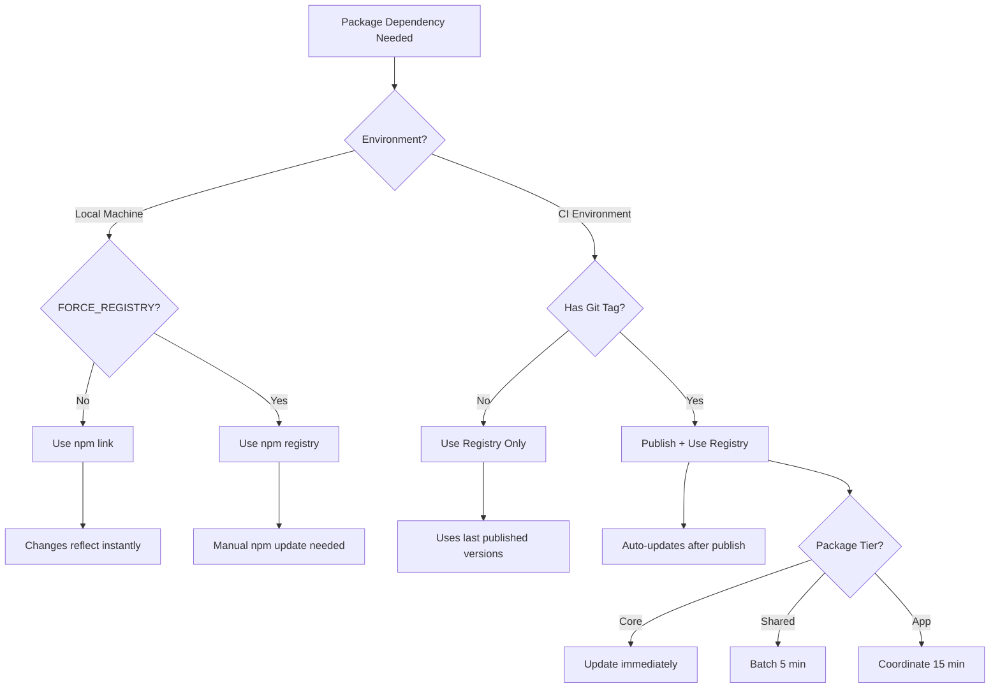

# Unified Dependency Update Strategy

> **Note**: This document supersedes all previous dependency update strategies including:
> - automated-version-bumping-guide.md
> - tag-based-publishing-guide.md  
> - immediate-update-strategies.md
> - developer-first-update-strategy.md
> - publishing-strategies-analysis.md

## Overview

A dual-mode system that supports both rapid local development and production-ready integration testing. Developers work fast locally with npm link, then tag commits for full pipeline verification.

## Core Principle

**"Develop fast locally, validate thoroughly in pipeline"**

- **Local Mode**: npm link for instant feedback during development
- **Pipeline Mode**: Tag-triggered publishing for integration testing
- **Zero friction**: Automated mode detection and switching

## The Two Modes

### 🚀 Local Development Mode (Default)

When working on your machine, all packages are automatically linked for instant updates:

```bash
# Just code normally - everything is already linked
cd packages/logger
# Make changes...
npm test  # Tests run against linked dependencies

# Changes are immediately available in all consumers
# No publish, no version bump, no waiting
```

### ✅ Pipeline Verification Mode (Tagged Commits)

When ready for integration testing, tag your commit:

```bash
# Tag format triggers pipeline mode
git tag -a v1.2.3 -m "feat: new logger features"
git push origin v1.2.3

# This triggers:
# 1. Publish all changed packages
# 2. Update all consumers
# 3. Full integration tests
# 4. Deploy if tests pass
```

## Complete Decision Flow



### Example Scenarios

1. **Developer working locally**: 
   - Environment: Local machine
   - FORCE_REGISTRY: Not set
   - Result: npm link mode, instant updates

2. **Testing production versions locally**:
   - Environment: Local machine
   - FORCE_REGISTRY: true
   - Result: Registry mode, manual updates

3. **PR build in CI**:
   - Environment: CI
   - Git tag: None
   - Result: **Use Registry Only** (no publish)
   - Action: `npm install` - uses last published versions
   - Purpose: Test against stable, already-published packages

4. **Release pipeline**:
   - Environment: CI
   - Git tag: v1.2.3
   - Result: **Publish + Use Registry**
   - Action: `npm publish` then `npm install`
   - Purpose: Publish new version, then test with it

### Registry Mode Clarification

#### "Use Registry Only" (No Publish)
- **When**: Regular CI runs (PRs, branch pushes), local with FORCE_REGISTRY
- **What happens**:
  ```bash
  # Installs whatever versions are specified in package.json
  npm ci  # Uses exact versions from package-lock.json
  # OR
  npm install  # Resolves versions based on package.json ranges (^1.0.0)
  ```
- **Purpose**: Use existing published versions (not necessarily "latest")
- **Version used**: Whatever satisfies the version range in package.json
- **No new versions created**

#### "Publish + Use Registry" (Tag-triggered)
- **When**: Tagged commits only (e.g., logger@1.2.3)
- **What happens**:
  ```bash
  # Step 1: IN THE PACKAGE BEING TAGGED
  npm version $TAG_VERSION --no-git-tag-version
  npm publish  # Publishes new version to registry
  
  # Step 2: IN THE META REPO (triggered by repository dispatch)
  # Installs the specific new version that was just published
  npm install @chasenocap/logger@1.2.3  # Specific version from tag
  
  # Step 3: OTHER PACKAGES
  # Will get the update based on their version ranges
  # If they have "^1.0.0", they'll get 1.2.3 on next install
  ```
- **Purpose**: Create new version AND ensure consumers use it
- **Version used**: The exact new version that was just published

## When to Use NPM Link vs Registry Packages

### Decision Logic

The system automatically determines which approach to use based on environment:

```javascript
// Decision tree for dependency resolution
if (process.env.CI === 'true') {
  // In CI/CD environment
  if (process.env.GITHUB_REF?.startsWith('refs/tags/')) {
    // Tagged commit = Release pipeline
    // ACTION: Publish new version THEN use registry
    // USE: Published packages from registry (including newly published)
    // WHY: Release new version and validate full integration
    return 'publish-and-use-registry';
  } else {
    // Regular CI run (PR, push to main)
    // ACTION: Just install, no publish
    // USE: Published packages from registry (existing versions)
    // WHY: Consistent, reproducible builds with stable versions
    return 'use-registry-only';
  }
} else {
  // Local development environment
  if (process.env.FORCE_REGISTRY === 'true') {
    // Developer explicitly wants registry
    // ACTION: Just install, no publish
    // USE: Published packages from registry
    // WHY: Testing against production versions locally
    return 'use-registry-only';
  } else {
    // Default local development
    // ACTION: Link packages, no registry interaction
    // USE: npm link (filesystem symlinks)
    // WHY: Instant feedback, no publish cycle
    return 'use-link';
  }
}
```

### Mode Characteristics

| Mode | Action | When | Purpose | Update Speed |
|------|--------|------|---------|--------------|
| **Use Link** | `npm link` only | Local dev (default) | Instant feedback during development | < 1 second |
| **Use Registry Only** | `npm install` only | CI builds, PRs, FORCE_REGISTRY | Test with stable versions | No new versions |
| **Publish + Registry** | `npm publish` → `npm install` | Tagged commits only | Release & validate new version | Creates new version |

### Detailed Mode Behaviors

| Environment | Has Tag? | FORCE_REGISTRY? | Mode | What Happens |
|-------------|----------|-----------------|------|--------------|
| Local | No | No | **Use Link** | Symlinks for instant updates |
| Local | No | Yes | **Use Registry Only** | Install existing versions |
| CI | No | N/A | **Use Registry Only** | Install existing versions |
| CI | Yes | N/A | **Publish + Registry** | Publish new, then install |

### Concrete Example

Let's say logger is currently at v1.0.1 in the registry, and package.json has:
```json
{
  "dependencies": {
    "@chasenocap/logger": "^1.0.0"
  }
}
```

**Scenario 1: PR Build (Use Registry Only)**
```bash
# CI runs on PR
npm ci
# Installs @chasenocap/logger@1.0.1 (from package-lock.json)
# No publish happens
```

**Scenario 2: Tagged Release (Publish + Registry)**
```bash
# Developer tags: git tag logger@1.2.0
# CI detects tag and runs:

# In logger package:
npm version 1.2.0 --no-git-tag-version
npm publish
# Now registry has v1.2.0

# In meta repo (via repository dispatch):
npm install @chasenocap/logger@1.2.0
# Specifically installs the new 1.2.0 version
# Updates package-lock.json to lock to 1.2.0
```

## Implementation

### 1. Automatic Mode Detection

```javascript
// scripts/detect-mode.js
const isCI = process.env.CI === 'true';
const hasTag = process.env.GITHUB_REF?.startsWith('refs/tags/');
const isLocalDev = !isCI && !hasTag;
const forceRegistry = process.env.FORCE_REGISTRY === 'true';

module.exports = {
  mode: isLocalDev && !forceRegistry ? 'local' : 'pipeline',
  useLinks: isLocalDev && !forceRegistry,
  useRegistry: isCI || forceRegistry || hasTag,
  shouldPublish: hasTag,
  environment: {
    isCI,
    hasTag,
    isLocalDev,
    forceRegistry
  }
};
```

### 2. Smart Package Manager

```javascript
// scripts/smart-deps.js
#!/usr/bin/env node

const { mode, useLinks, useRegistry } = require('./detect-mode');

class SmartDependencyManager {
  async setup() {
    console.log('🔍 Detecting environment...');
    console.log(`Mode: ${mode}`);
    console.log(`Use Links: ${useLinks}`);
    console.log(`Use Registry: ${useRegistry}`);
    
    if (useLinks) {
      await this.setupLocalMode();
    } else {
      await this.setupPipelineMode();
    }
  }

  async setupLocalMode() {
    console.log('🚀 Local Development Mode - Setting up npm links...');
    
    // Link all workspace packages
    const packages = await this.getWorkspacePackages();
    
    // First, create all links
    for (const pkg of packages) {
      await exec(`cd ${pkg.path} && npm link`);
    }
    
    // Then, link dependencies
    for (const pkg of packages) {
      for (const dep of pkg.localDependencies) {
        await exec(`cd ${pkg.path} && npm link ${dep}`);
      }
    }
    
    console.log('✅ All packages linked for instant updates!');
  }

  async setupPipelineMode() {
    console.log('✅ Pipeline Mode - Using published versions');
    
    // Install from registry
    await exec('npm ci');
    
    // Update to latest if triggered by tag
    if (process.env.UPDATE_TO_LATEST) {
      await exec('npm update @chasenocap/*');
    }
  }
}

// Auto-run on install
if (require.main === module) {
  new SmartDependencyManager().setup();
}
```

### 3. Development Workflow Script

```bash
#!/bin/bash
# scripts/dev.sh - Developer convenience script

echo "🔧 H1B Analysis Development Environment"
echo "======================================"

# Detect current mode
if [ -z "$CI" ]; then
  echo "📍 Mode: Local Development (npm link)"
  echo "✨ All changes are instantly available across packages"
  
  # Setup links if needed
  if [ ! -L "node_modules/@chasenocap/logger" ]; then
    echo "Setting up package links..."
    node scripts/smart-deps.js
  fi
  
  # Watch mode for all packages
  echo ""
  echo "Starting development watchers..."
  npm run dev:watch
else
  echo "📍 Mode: Pipeline Verification"
  echo "🏗️ Using published package versions"
fi
```

### 4. Unified Package Workflow

Each package gets this enhanced workflow:

```yaml
name: Smart Package Workflow

on:
  push:
    branches: [main]
    tags:
      - 'v*.*.*'
      - '*@*.*.*'  # Support scoped version tags

jobs:
  process:
    runs-on: ubuntu-latest
    steps:
      - uses: actions/checkout@v4
        with:
          fetch-depth: 0
          
      - name: Detect Mode
        id: mode
        run: |
          if [[ $GITHUB_REF == refs/tags/* ]]; then
            echo "mode=pipeline" >> $GITHUB_OUTPUT
            echo "publish=true" >> $GITHUB_OUTPUT
            
            # Extract version from tag
            VERSION=${GITHUB_REF#refs/tags/}
            VERSION=${VERSION#v}  # Remove v prefix if present
            echo "version=$VERSION" >> $GITHUB_OUTPUT
          else
            echo "mode=development" >> $GITHUB_OUTPUT
            echo "publish=false" >> $GITHUB_OUTPUT
          fi
          
      - name: Setup Dependencies
        run: |
          if [[ "${{ steps.mode.outputs.mode }}" == "pipeline" ]]; then
            # Pipeline mode - use registry
            npm ci
          else
            # Dev mode simulation in CI
            npm ci
          fi
          
      - name: Build and Test
        run: |
          npm run build
          npm test
          
      - name: Publish (Pipeline Mode Only)
        if: steps.mode.outputs.publish == 'true'
        run: |
          # Set version from tag
          npm version ${{ steps.mode.outputs.version }} --no-git-tag-version
          
          # Publish to registry
          npm publish
          
          # Notify consumers
          curl -X POST ${{ secrets.WEBHOOK_URL }} \
            -d '{
              "package": "${{ github.repository }}",
              "version": "${{ steps.mode.outputs.version }}",
              "mode": "pipeline"
            }'
```

### 5. Meta Repository Integration

The meta repository automatically handles both modes:

```yaml
name: Smart Dependency Updates

on:
  repository_dispatch:
    types: [package-published]
  push:
    paths:
      - 'packages/**'
  workflow_dispatch:

jobs:
  update:
    runs-on: ubuntu-latest
    steps:
      - name: Checkout
        uses: actions/checkout@v4
        with:
          submodules: recursive
          
      - name: Detect Update Mode
        id: mode
        run: |
          if [[ "${{ github.event_name }}" == "repository_dispatch" ]]; then
            echo "mode=pipeline" >> $GITHUB_OUTPUT
            echo "source=publish" >> $GITHUB_OUTPUT
          else
            echo "mode=local" >> $GITHUB_OUTPUT
            echo "source=direct" >> $GITHUB_OUTPUT
          fi
          
      - name: Update Dependencies
        run: |
          if [[ "${{ steps.mode.outputs.mode }}" == "pipeline" ]]; then
            # Pipeline mode - update from registry
            PACKAGE="${{ github.event.client_payload.package }}"
            VERSION="${{ github.event.client_payload.version }}"
            
            # Update npm dependency
            npm install ${PACKAGE}@${VERSION}
            
            # Update git submodule to matching tag
            cd packages/${PACKAGE##*/}
            git fetch --tags
            git checkout v${VERSION}
            cd ../..
            
            # Commit
            git add .
            git commit -m "chore: update ${PACKAGE} to ${VERSION} [pipeline]"
            git push
          else
            # Local mode - just ensure submodules are current
            git submodule update --remote --merge
          fi
```

### 6. Developer Setup Script

```bash
#!/bin/bash
# scripts/setup-dev.sh - One-time setup for developers

echo "🚀 Setting up H1B Analysis development environment..."

# Clone with submodules
if [ ! -d "packages" ]; then
  git submodule update --init --recursive
fi

# Install root dependencies
npm install

# Setup smart dependency manager
npm run setup:links

# Create convenience aliases
cat >> ~/.bashrc << 'EOF'
# H1B Analysis aliases
alias h1b-dev="npm run dev"
alias h1b-test="npm run test:all"
alias h1b-publish="npm run publish:tagged"
EOF

echo "✅ Development environment ready!"
echo ""
echo "Quick commands:"
echo "  h1b-dev     - Start development mode with watching"
echo "  h1b-test    - Run all tests"
echo "  h1b-publish - Publish tagged version"
```

## Package Update Flow

### Local Development Flow (npm link)

```
Developer edits packages/logger/src/index.ts
                    ↓ (filesystem watch)
              Instant update
                    ↓
    All linked consumers see changes immediately
                    ↓
         No version change, no publish
                    ↓
            Test locally with:
    - npm test (in any package)
    - npm run dev (meta repo)
```

### Pipeline Integration Flow (tagged release)

```
Developer tags: git tag logger@1.2.3
                    ↓
            Push triggers workflow
                    ↓
         Package publishes to registry
                    ↓
        Repository dispatch fired
                    ↓
    Meta repo updates dependency
                    ↓
     Strategic grouping applied:
     - Core: Immediate update
     - Shared: 5-min batch
     - App: 15-min coordinate
                    ↓
    Integration tests validate
                    ↓
         Deploy if successful
```

## Developer Experience

### Daily Development Flow

```bash
# 1. Start your day
cd h1b-visa-analysis
npm run dev  # Everything is linked and watching

# 2. Make changes in any package
cd packages/logger
# Edit files... changes are instantly available everywhere

# 3. Test across packages without publishing
cd ../cache
npm test  # Uses your local logger changes automatically

# 4. When ready for integration
git add .
git commit -m "feat: awesome new feature"
git tag -a logger@1.2.3 -m "New logger features"
git push origin main --tags

# This triggers full pipeline validation
```

### Testing Against Production Versions

```bash
# Force registry mode locally
FORCE_REGISTRY=true npm install

# Now using published versions
npm test  # Tests against registry packages

# Switch back to link mode
npm run dev:setup
```

### Mode Indicators

The system provides clear feedback about current mode:

```bash
$ npm run dev
🚀 Local Development Mode Active
✨ Package links:
  ✓ @chasenocap/logger → packages/logger
  ✓ @chasenocap/cache → packages/cache
  ✓ @chasenocap/di-framework → packages/di-framework
  
⚡ All changes are instantly reflected across packages
```

## Configuration

### Package.json Scripts

```json
{
  "scripts": {
    "dev": "node scripts/smart-deps.js && npm run watch",
    "dev:setup": "node scripts/setup-links.js",
    "dev:status": "node scripts/check-links.js",
    "publish:tagged": "node scripts/publish-if-tagged.js",
    "test": "node scripts/smart-test.js",
    "ci": "MODE=pipeline npm test"
  }
}
```

### Mode Configuration

```javascript
// .devmode.json - Optional configuration
{
  "local": {
    "autoLink": true,
    "watchAll": true,
    "testMode": "fast"
  },
  "pipeline": {
    "publishStrategy": "immediate",
    "testMode": "full",
    "notifyChannels": ["slack", "github"]
  },
  "packages": {
    "logger": {
      "tier": "core",
      "alwaysPublish": true
    },
    "test-helpers": {
      "tier": "dev",
      "linkOnly": true  // Never publish, always link
    }
  }
}
```

## Benefits

1. **Fast Local Development**: No publish/install cycles during development
2. **Reliable Integration**: Tagged commits ensure full validation
3. **Zero Configuration**: Automatic mode detection
4. **Clear Separation**: Local experiments don't affect pipeline
5. **Simple Mental Model**: Develop locally, tag to release

## Migration Path

### Week 1: Setup Infrastructure
- Deploy smart-deps.js to all packages
- Update workflows to support dual-mode
- Create developer setup documentation

### Week 2: Developer Onboarding
- Run setup script for all developers
- Training on local vs pipeline modes
- Establish tagging conventions

### Week 3: Full Adoption
- All development uses local mode
- All releases use pipeline mode
- Monitor and optimize

## Success Metrics

- **Local Development**: Changes reflected in < 1 second
- **Pipeline Validation**: < 5 minutes from tag to deployed
- **Developer Satisfaction**: Zero complaints about slow updates
- **Integration Quality**: 100% of tagged commits pass tests

## Advanced Features

### Strategic Package Grouping

When in pipeline mode, packages are grouped by tier to prevent update fatigue:

```javascript
// Tier definitions from developer-first strategy
const PACKAGE_TIERS = {
  core: {
    packages: ['di-framework', 'logger'],
    strategy: 'immediate',
    grouping: false
  },
  shared: {
    packages: ['cache', 'file-system', 'event-system', 'test-mocks', 'test-helpers'],
    strategy: 'batch-5min',
    grouping: true
  },
  app: {
    packages: ['report-templates', 'markdown-compiler', 'report-components', 'prompts'],
    strategy: 'coordinate-15min',
    grouping: true
  }
};
```

### Tag Conventions

Support multiple tagging strategies for different scenarios:

```bash
# Single package release
git tag logger@1.2.3 -m "fix: logger memory leak"

# Grouped release (all shared packages)
git tag shared@2.0.0 -m "feat: shared utilities major update"

# Full ecosystem release
git tag v3.0.0 -m "feat: major ecosystem update"

# Development preview
git tag v3.0.0-beta.1 -m "preview: upcoming features"
```

### Automated Version Bumping

In pipeline mode, versions can be auto-determined from commits:

```yaml
- name: Auto Version from Commits
  if: startsWith(github.ref, 'refs/tags/auto-')
  run: |
    # Analyze commits since last tag
    BUMP_TYPE=$(git log $(git describe --tags --abbrev=0)..HEAD --pretty=%B | \
      grep -E "^(feat|fix|BREAKING)" | \
      awk '{
        if (/^BREAKING/) { print "major"; exit }
        else if (/^feat/) { has_feat=1 }
        else if (/^fix/) { has_fix=1 }
      } END {
        if (has_feat) print "minor"
        else if (has_fix) print "patch"
        else print "patch"
      }')
    
    npm version $BUMP_TYPE
```

## Troubleshooting

### Common Issues and Solutions

#### 1. "Package not found" in local mode
```bash
# Rebuild all links
npm run dev:setup --force

# Verify links
npm run dev:status
```

#### 2. Pipeline mode using old versions
```bash
# Force update in pipeline
UPDATE_TO_LATEST=true npm ci

# Clear caches
npm cache clean --force
```

#### 3. Switching between modes
```bash
# Clean switch from local to pipeline
npm run clean:links
npm ci

# Clean switch from pipeline to local
npm run dev:setup
```

## Comparison with Previous Strategies

This unified approach combines the best of all strategies:

1. **From Push-Based Publishing**: Automatic versioning and publishing
2. **From Tag-Based Publishing**: Explicit control and stable releases  
3. **From Developer-First**: Instant feedback and zero friction
4. **From Event-Driven**: Smart dependency cascade handling
5. **From Subscription Model**: Strategic grouping to prevent fatigue

## Leveraging Renovate for Enhanced Automation

### Current Renovate Integration

Our existing Renovate configuration already provides:
- Automatic grouping of @chasenocap packages
- Git submodule synchronization
- Immediate PR creation with automerge

### Enhanced Renovate Configuration

To better support our dual-mode strategy, we can enhance Renovate:

```json
{
  "packageRules": [
    {
      "description": "Core packages - immediate updates",
      "matchPackagePatterns": ["^@chasenocap/(di-framework|logger)$"],
      "groupName": "Core Infrastructure",
      "schedule": ["at any time"],
      "automerge": true,
      "rangeStrategy": "update-lockfile",
      "prPriority": 100
    },
    {
      "description": "Shared utilities - 5 min batch",
      "matchPackagePatterns": ["^@chasenocap/(cache|file-system|event-system|test-)"],
      "groupName": "Shared Utilities",
      "schedule": ["every 5 minutes"],
      "automerge": true,
      "rangeStrategy": "update-lockfile",
      "prPriority": 50
    },
    {
      "description": "App packages - 15 min coordinate",
      "matchPackagePatterns": ["^@chasenocap/(report-|markdown-|prompts)"],
      "groupName": "Application Layer",
      "schedule": ["every 15 minutes"],
      "automerge": true,
      "rangeStrategy": "update-lockfile",
      "prPriority": 10
    }
  ],
  "postUpgradeTasks": {
    "commands": [
      "node scripts/sync-submodules.js {{{depName}}} {{{newVersion}}}",
      "npm run test:integration"
    ],
    "fileFilters": ["package.json", "package-lock.json"],
    "executionMode": "update"
  }
}
```

### Renovate + Local Development Integration

#### 1. Post-Upgrade Tasks for Link Preservation

```json
{
  "postUpgradeTasks": {
    "commands": [
      "node scripts/preserve-links.js",
      "npm run validate:links"
    ],
    "executionMode": "branch"
  }
}
```

This ensures npm links are preserved after Renovate updates in development.

#### 2. Branch Strategies for Testing

```json
{
  "branchPrefix": "renovate/",
  "additionalBranchPrefix": "{{packageFileDir}}-",
  "packageRules": [
    {
      "matchPackagePatterns": ["^@chasenocap/"],
      "branchName": "renovate/internal-{{groupSlug}}"
    }
  ]
}
```

#### 3. Smart Grouping Based on Tiers

```javascript
// scripts/renovate-grouping.js
module.exports = {
  getGroupName: (packageName) => {
    const tiers = {
      core: ['di-framework', 'logger'],
      shared: ['cache', 'file-system', 'event-system', 'test-mocks', 'test-helpers'],
      app: ['report-templates', 'markdown-compiler', 'report-components', 'prompts']
    };
    
    for (const [tier, packages] of Object.entries(tiers)) {
      if (packages.some(pkg => packageName.includes(pkg))) {
        return `${tier}-updates`;
      }
    }
    return 'misc-updates';
  }
};
```

### Advanced Renovate Features for Our Strategy

#### 1. Range Strategy Optimization

Use `update-lockfile` for minimal package.json changes:
```json
{
  "rangeStrategy": "update-lockfile",
  "lockFileMaintenance": {
    "enabled": true,
    "schedule": ["before 3am on Monday"],
    "automerge": true
  }
}
```

This keeps package.json ranges stable while updating lock files, perfect for our dual-mode approach.

#### 2. Custom Managers for Submodules

```json
{
  "customManagers": [
    {
      "customType": "regex",
      "fileMatch": ["^\\.gitmodules$"],
      "matchStrings": [
        "path = packages/(?<depName>.*?)\\s+url = .*?/(?<currentValue>v?\\d+\\.\\d+\\.\\d+)"
      ],
      "datasourceTemplate": "github-tags",
      "versioningTemplate": "semver"
    }
  ]
}
```

#### 3. Conditional Auto-merge Based on Mode

```json
{
  "packageRules": [
    {
      "matchPackagePatterns": ["^@chasenocap/"],
      "matchFiles": ["package.json"],
      "automerge": true,
      "platformAutomerge": true,
      "automergeSchedule": ["after 10pm and before 5am"]
    },
    {
      "matchFiles": ["packages/*/package.json"],
      "enabled": false,
      "description": "Disable Renovate in submodules - handled by tag releases"
    }
  ]
}
```

### Benefits of Enhanced Renovate Integration

1. **Automated Tier Management**: Renovate respects our package tiers automatically
2. **Preserved Local Links**: postUpgradeTasks ensure development mode isn't disrupted
3. **Smart Batching**: Updates grouped by tier matching our strategy
4. **Submodule Sync**: Automatic git submodule updates with npm packages
5. **Testing Integration**: Validates updates before merge
6. **Lock File Maintenance**: Keeps dependencies fresh without changing ranges
7. **Off-hours Merging**: Reduces disruption during development

## Summary

This unified strategy gives developers the best of both worlds:
- **Instant feedback** during local development with npm link
- **Thorough validation** for integration via tagged commits
- **Automatic mode switching** based on context
- **Simple commands** that just work
- **Strategic grouping** when updates are published
- **Full control** when needed via tags
- **Renovate automation** that respects our dual-mode approach

The system respects that developers need speed during development but also ensures quality through proper integration testing when it matters.